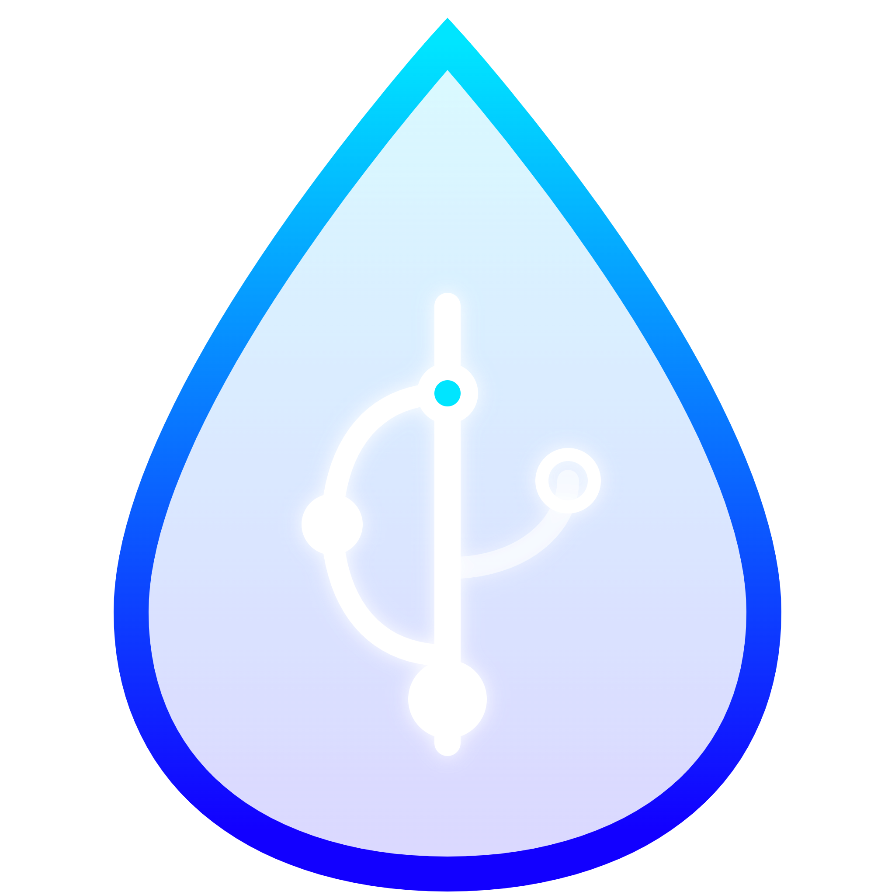

<div align="center">
  
  <h1 align="center">VaporGit</h1>
  <p align="center">
    <strong>An ultra-lightweight cross-platform Git desktop client built with Tauri + SolidJS</strong>
  </p>
  <p align="center">
    VaporGit focuses on delivering a lightweight, elegant core experience — beautiful, intuitive, and efficient Git visual management.
  </p>

  <p align="center">
    <a href="https://tauri.app/"></a>
    <a href="https://www.solidjs.com/"></a>
    <a href="https://www.rust-lang.org/"></a>
  </p>
  <p align="center">
    <a href="./README/README.zh-CN.md">简体中文</a> ·
    <a href="./README/README.zh-TW.md">繁體中文</a> ·
    <a href="./README/README.ja.md">日本語</a> ·
    <a href="./README/README.ko.md">한국어</a> ·
    <a href="./README/README.fr.md">Français</a> ·
    <a href="./README/README.de.md">Deutsch</a> ·
    <a href="./README/README.ar.md">العربية</a> ·
    <a href="./README/README.es.md">Español</a> ·
    <a href="./README/README.pt.md">Português</a> ·
    <a href="./README/README.ru.md">Русский</a>
  </p>
</div>

<br/>

## ✨ Key Features

- **🌳 Beautiful interactive commit graph (DAG)**: Visual rendering of multi-branch logic, clearly displaying the version history.
- **🔍 High-performance diff viewer**: Millisecond-level file diff comparison with line-level syntax highlighting.
- **⚡ Blazing fast & lightweight (Tauri+Rust)**: Say goodbye to Electron's GBs of memory — enjoy a smooth, native-like experience.
- **🛠 Full Git workflow support**: From staging, committing, branch management, to conflict resolution and remote sync — all daily operations covered.

---

## 📥 Download

Download the latest installer for your platform from the [GitHub Releases](https://github.com/Atom112/VaporGit/releases) page — no local build required.

| Platform | Package Format | Notes |
|----------|---------------|-------|
| **Windows** | `.msi` / `.exe` | Double-click to install. Requires WebView2 Runtime. |
| **macOS** | `.dmg` | Open and drag VaporGit into Applications. |
| **Linux** | `.deb` / `.AppImage` / `.rpm` | `.deb` for Debian/Ubuntu; `.rpm` for Fedora/RHEL; `.AppImage` is universal — `chmod +x` and run. |

---

## 🛠️ Build & Development

VaporGit uses a hybrid architecture of modern Web tech and Rust. Make sure your environment is ready before getting started.

### 📌 Prerequisites

- **Node.js**: 20+
- **npm**: 10+
- **Rust**: stable channel
- **System dependencies**: Windows users need Microsoft C++ Build Tools and WebView2 Runtime.

### 🚀 Quick Start

```powershell
# Install all frontend and project dependencies
npm install

# Start the frontend dev server only (for styling and UI work)
npm run dev

# Start full Tauri desktop dev mode (with Rust hot-reload)
npm run tauri dev
```

### 📦 Production Build

```powershell
# Build frontend static assets
npm run build

# Build platform-specific installers (macOS .dmg / Windows .msi / Linux .AppImage)
npm run tauri build
```

---

## 📚 More Info

- **🏆 Changelog**: See [CHANGELOG.md](./CHANGELOG.md).
- **🗺️ Roadmap**: See [doc/plan.md](./doc/plan.md).

---

## 📝 License

This project is licensed under the terms of the `LICENSE` file in the repository root.